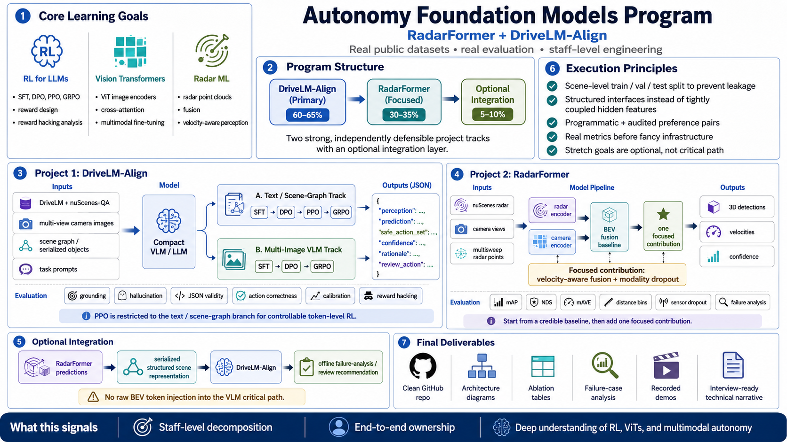
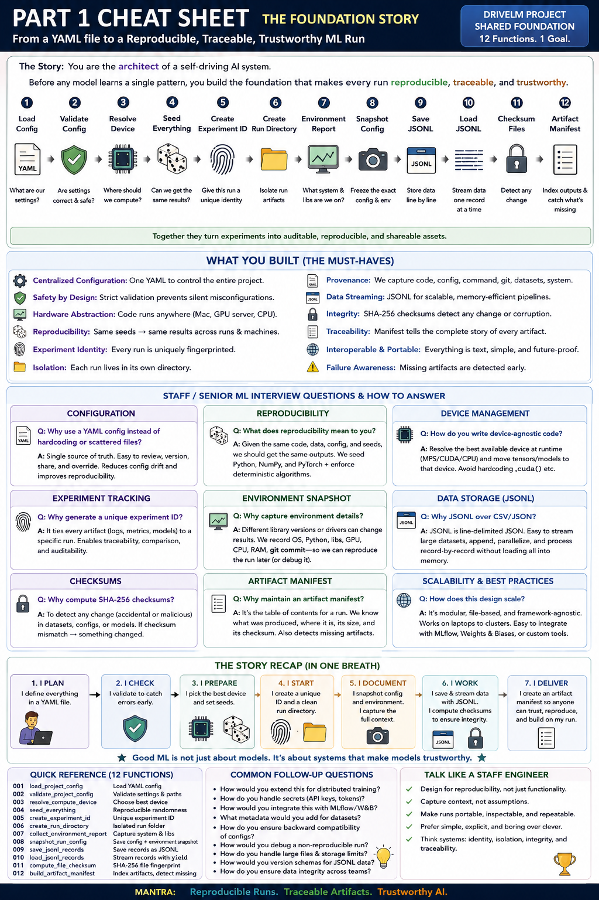
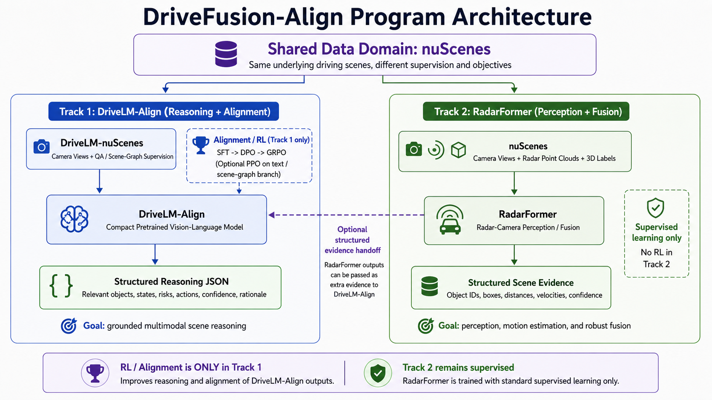

# Autonomy Foundation Models

**RadarFormer + DriveLM-Align**

Two connected, independently defensible projects for real-data autonomy foundation models:

- **DriveLM-Align:** multimodal scene understanding and post-training with SFT, DPO, GRPO, and a controlled text-policy PPO branch.
- **RadarFormer:** pretrained radar-camera perception, focused fine-tuning, velocity-aware fusion, and robustness analysis.








## Program boundaries

- Pretrained checkpoints only; no foundation model is trained from random initialization.
- Public supervision and programmatic rewards; no large manual-labeling campaign.
- MacBook Pro for development, data work, inspection, and analysis; bounded cloud NVIDIA runs for large training.
- No agentic-AI scope in the critical path.
- RadarFormer and DriveLM-Align must work independently before optional integration.

## End-to-end roadmap

```text
Shared project foundation
        │
        ├── DriveLM data → canonical records → rewards/evaluation
        │       → pretrained VLM + LoRA SFT → DPO → GRPO
        │       → controlled text-policy PPO → held-out comparison
        │
        ├── nuScenes radar data → pretrained baseline reproduction
        │       → focused fine-tuning → velocity-aware fusion
        │       → robustness and failure analysis
        │
        └── Optional structured integration
                RadarFormer predictions → serialized scene record
                → DriveLM-Align failure-analysis report
```

## Build curriculum

The implementation is broken into 241 concrete functions. Each function becomes part of the repository and is completed in sequence.

<details>
<summary><strong>PART 01: Shared Project Foundation</strong></summary>

Create the reproducible monorepo, device abstraction, configuration system, run registry, and artifact contracts used by both projects.

| ID | Function / module | What it implements |
|---:|---|---|
| 001 | `load_project_config src/common/config.py` | Load YAML configuration and resolve environment-variable overrides without mutating the source file. |
| 002 | `validate_project_config src/common/config.py` | Validate dataset paths, checkpoint identifiers, split names, precision, and runtime-specific constraints. |
| 003 | `resolve_compute_device src/common/device.py` | Select CPU, Apple MPS, or CUDA explicitly and expose device capabilities to downstream modules. |
| 004 | `seed_everything src/common/reproducibility.py` | Seed Python, NumPy, PyTorch, CUDA/MPS-safe generators, and dataloader workers. |
| 005 | `collect_environment_report src/common/environment.py` | Capture OS, Python, package versions, GPU/MPS details, memory, git commit, and model/dataset versions. |
| 006 | `create_experiment_id src/common/runs.py` | Create a stable human-readable experiment identifier from project, model, dataset, method, and timestamp. |
| 007 | `create_run_directory src/common/runs.py` | Create the standard run tree for configs, logs, checkpoints, predictions, metrics, figures, and notes. |
| 008 | `snapshot_run_config src/common/runs.py` | Persist the fully resolved configuration, command, git diff status, and environment report before execution. |
| 009 | `save_jsonl_records src/common/io.py` | Write canonical records to JSONL atomically with UTF-8 encoding and stable key ordering. |
| 010 | `load_jsonl_records src/common/io.py` | Stream JSONL records with schema-aware error reporting and optional sample limits. |
| 011 | `compute_file_checksum src/common/checksums.py` | Compute SHA-256 checksums for manifests, processed datasets, adapters, and reports. |
| 012 | `build_artifact_manifest src/common/artifacts.py` | Index all files produced by a run with type, path, size, checksum, and provenance. |

</details>

<details>
<summary><strong>PART 02: DriveLM Data Access and Leakage-Safe Splits</strong></summary>

Load the public DriveLM supervision, resolve camera assets, and create scene-level train/validation/test partitions.

| ID | Function / module | What it implements |
|---:|---|---|
| 013 | `load_drivelm_annotations src/drivelm_align/data/raw.py` | Load the official DriveLM annotation JSON and preserve every original scene, frame, QA, and object identifier. |
| 014 | `build_drivelm_scene_index src/drivelm_align/data/index.py` | Build a scene-token index containing frames, camera views, QA records, and referenced objects. |
| 015 | `resolve_drivelm_image_paths src/drivelm_align/data/images.py` | Resolve each camera reference against the local DriveLM/nuScenes image root. |
| 016 | `validate_drivelm_images src/drivelm_align/data/images.py` | Validate image existence, readability, dimensions, camera identity, and duplicate paths. |
| 017 | `extract_drivelm_qa_records src/drivelm_align/data/qa.py` | Flatten the native QA graph into typed task records while retaining source hierarchy and provenance. |
| 018 | `extract_drivelm_object_tags src/drivelm_align/data/objects.py` | Parse key-object tags, camera view, category, status, and native 2D box metadata. |
| 019 | `group_records_by_scene src/drivelm_align/data/grouping.py` | Group all image, QA, and object records by scene_token before any split operation. |
| 020 | `split_scene_tokens src/drivelm_align/data/splits.py` | Create deterministic train/validation/test scene-token partitions using a fixed seed and configured ratios. |
| 021 | `assign_records_to_split src/drivelm_align/data/splits.py` | Assign every canonical record to the split inherited from its scene token. |
| 022 | `assert_scene_split_disjointness src/drivelm_align/data/validation.py` | Assert that scene-token intersections between train, validation, and test are empty. |
| 023 | `assert_frame_split_disjointness src/drivelm_align/data/validation.py` | Detect shared frame tokens, image paths, or aliases across dataset splits. |
| 024 | `compute_split_statistics src/drivelm_align/data/statistics.py` | Measure task, camera, object, scene-condition, prompt-length, and answer-length distributions per split. |
| 025 | `write_split_manifests src/drivelm_align/data/splits.py` | Persist scene lists and record manifests with source checksum, seed, and split policy. |
| 026 | `load_split_manifest src/drivelm_align/data/splits.py` | Load an immutable split manifest and verify its source/checksum compatibility. |
| 027 | `build_drivelm_local_subset src/drivelm_align/data/subsets.py` | Create tiny deterministic subsets that preserve scene boundaries and task diversity. |
| 028 | `render_drivelm_multiview_scene src/drivelm_align/visualization/scenes.py` | Render synchronized camera views with scene/frame identifiers and key-object overlays. |

</details>

<details>
<summary><strong>PART 03: DriveLM Canonical Records, Scene Graphs, and Prompting</strong></summary>

Convert native supervision into one versioned record contract shared by prompting, SFT, DPO, GRPO, PPO, and evaluation.

| ID | Function / module | What it implements |
|---:|---|---|
| 029 | `parse_object_tag src/drivelm_align/schema/objects.py` | Parse a native DriveLM object tag into a typed object reference without losing the original identifier. |
| 030 | `normalize_object_category src/drivelm_align/schema/objects.py` | Map category aliases into a controlled vocabulary while storing the original category. |
| 031 | `normalize_object_state src/drivelm_align/schema/objects.py` | Normalize moving, stopped, parked, and unknown states without inventing unavailable velocity labels. |
| 032 | `build_object_alias_map src/drivelm_align/schema/aliases.py` | Create stable short object aliases for prompts and outputs, with a reversible map to source tags. |
| 033 | `restore_original_object_ids src/drivelm_align/schema/aliases.py` | Translate model-facing aliases back to original source identifiers for evaluation and auditing. |
| 034 | `derive_acceptable_action_set src/drivelm_align/schema/actions.py` | Derive a defensible set of acceptable and prohibited actions only when public answers or explicit rules support it. |
| 035 | `build_canonical_scene_record src/drivelm_align/schema/records.py` | Assemble scene, images, QA, objects, source answer, provenance, and split into one typed record. |
| 036 | `validate_scene_record src/drivelm_align/schema/validation.py` | Validate identifiers, images, object references, task fields, and split metadata. |
| 037 | `serialize_scene_graph src/drivelm_align/schema/serialization.py` | Serialize object aliases, categories, states, and allowed metadata into deterministic compact text. |
| 038 | `build_multimodal_prompt src/drivelm_align/prompts/multimodal.py` | Construct the image-plus-instruction prompt used by the VLM branch. |
| 039 | `build_text_policy_prompt src/drivelm_align/prompts/text_policy.py` | Construct the controlled text/scene-graph prompt used for DPO, PPO, and algorithmic ablations. |
| 040 | `build_target_json src/drivelm_align/schema/targets.py` | Convert supported DriveLM supervision into the structured output contract. |
| 041 | `canonicalize_target_json src/drivelm_align/schema/targets.py` | Sort lists, normalize enums, clamp confidence, and standardize optional fields for exact comparison. |
| 042 | `validate_target_json src/drivelm_align/schema/validation.py` | Validate model targets and predictions against the JSON schema and per-task field requirements. |
| 043 | `tokenize_multimodal_sample src/drivelm_align/tokenization/multimodal.py` | Apply the selected VLM processor to images, prompt, and target while preserving modality metadata. |
| 044 | `build_response_label_mask src/drivelm_align/tokenization/labels.py` | Mask prompt, image placeholder, padding, and non-response positions from supervised loss. |

</details>

<details>
<summary><strong>PART 04: DriveLM Metrics and Programmatic Reward System</strong></summary>

Create deterministic evaluation and reward components before training any alignment method.

| ID | Function / module | What it implements |
|---:|---|---|
| 045 | `extract_json_payload src/drivelm_align/evaluation/parsing.py` | Extract the first complete JSON object from generated text without silently changing semantic content. |
| 046 | `parse_structured_response src/drivelm_align/evaluation/parsing.py` | Parse and canonicalize a generated response into the typed output schema. |
| 047 | `score_json_validity src/drivelm_align/evaluation/format.py` | Score exact schema validity, required fields, enum validity, and prohibited extras. |
| 048 | `object_set_precision src/drivelm_align/evaluation/grounding.py` | Compute precision over predicted versus target relevant-object ID sets. |
| 049 | `object_set_recall src/drivelm_align/evaluation/grounding.py` | Compute recall over predicted versus target relevant-object ID sets. |
| 050 | `object_set_f1 src/drivelm_align/evaluation/grounding.py` | Compute set-based object F1; never misuse geometric IoU for discrete IDs. |
| 051 | `object_state_accuracy src/drivelm_align/evaluation/states.py` | Score state assignments only for objects with supported target states. |
| 052 | `interaction_consistency_score src/drivelm_align/evaluation/relations.py` | Score predicted interactions against supported relation/answer evidence. |
| 053 | `action_set_score src/drivelm_align/evaluation/actions.py` | Score whether the proposed action falls inside acceptable, prohibited, or unevaluable sets. |
| 054 | `expected_calibration_error src/drivelm_align/evaluation/calibration.py` | Measure confidence calibration over task correctness using fixed bins. |
| 055 | `hallucination_rate src/drivelm_align/evaluation/grounding.py` | Measure the fraction of cited object IDs absent from the scene evidence. |
| 056 | `prohibited_action_penalty src/drivelm_align/rewards/safety.py` | Apply a penalty only when the generated action is explicitly prohibited by supported supervision. |
| 057 | `confidence_overstatement_penalty src/drivelm_align/rewards/calibration.py` | Penalize high confidence on incorrect or unsupported structured claims. |
| 058 | `reward_format src/drivelm_align/rewards/components.py` | Return the normalized formatting/schema component used by GRPO and PPO. |
| 059 | `reward_grounding src/drivelm_align/rewards/components.py` | Combine object F1, state correctness, and hallucination evidence into a grounding component. |
| 060 | `reward_reasoning src/drivelm_align/rewards/components.py` | Combine supported prediction and action-set components without relying exclusively on an LLM judge. |
| 061 | `compose_alignment_reward src/drivelm_align/rewards/composite.py` | Combine versioned component rewards and penalties into a scalar training reward. |
| 062 | `evaluate_alignment_prediction src/drivelm_align/evaluation/evaluate.py` | Produce per-example metrics, reward components, parse errors, and audit metadata. |

</details>

<details>
<summary><strong>PART 05: Pretrained VLM Baseline and LoRA SFT</strong></summary>

Adapt a pretrained compact VLM to real DriveLM images and structured outputs without training a foundation model from scratch.

| ID | Function / module | What it implements |
|---:|---|---|
| 063 | `load_pretrained_vlm src/drivelm_align/models/vlm.py` | Load the selected pretrained VLM checkpoint with configured dtype, attention implementation, and device map. |
| 064 | `load_multimodal_processor src/drivelm_align/models/vlm.py` | Load the matching processor/chat template and verify model-processor compatibility. |
| 065 | `configure_vlm_lora src/drivelm_align/models/lora.py` | Attach LoRA adapters to justified language and/or multimodal projection modules. |
| 066 | `freeze_vlm_base_parameters src/drivelm_align/models/lora.py` | Freeze all pretrained backbone parameters except explicitly approved adapters and heads. |
| 067 | `count_trainable_parameters src/drivelm_align/models/inspection.py` | Report total, trainable, adapter, and value-head parameter counts. |
| 068 | `format_vlm_chat_example src/drivelm_align/training/formatting.py` | Create the exact multimodal chat sequence for supervised training and generation. |
| 069 | `collate_multimodal_batch src/drivelm_align/training/collators.py` | Pad and batch variable image counts, text lengths, pixel tensors, labels, and metadata. |
| 070 | `compute_vlm_sft_loss src/drivelm_align/training/sft.py` | Compute response-token cross-entropy using the model output and label mask. |
| 071 | `vlm_sft_train_step src/drivelm_align/training/sft.py` | Run forward, backward, gradient accumulation, clipping, optimizer, and scheduler for one SFT step. |
| 072 | `vlm_sft_eval_step src/drivelm_align/training/sft.py` | Compute deterministic validation loss and structured generations without optimizer updates. |
| 073 | `generate_vlm_response src/drivelm_align/inference/vlm.py` | Generate a response with fixed decoding controls and return token/latency metadata. |
| 074 | `overfit_vlm_microset src/drivelm_align/training/debug.py` | Overfit a tiny audited dataset to verify labels, masks, LoRA, and optimizer behavior. |
| 075 | `train_vlm_sft src/drivelm_align/training/sft.py` | Run checkpointed LoRA SFT with validation, fixed-sample generations, and complete run logging. |
| 076 | `evaluate_vlm_sft_checkpoint src/drivelm_align/evaluation/checkpoints.py` | Evaluate base and SFT adapters on the same immutable validation/test protocol. |

</details>

<details>
<summary><strong>PART 06: Preference Dataset Generation and VLM DPO</strong></summary>

Create programmatic and model-assisted chosen/rejected pairs, audit them, and train DPO from the SFT checkpoint.

| ID | Function / module | What it implements |
|---:|---|---|
| 077 | `build_chosen_response src/drivelm_align/preferences/chosen.py` | Create a canonical chosen response from supported public supervision or an audited correct SFT output. |
| 078 | `corrupt_json_structure src/drivelm_align/preferences/corruptions.py` | Create a controlled format-negative while preserving most semantic content. |
| 079 | `inject_hallucinated_object src/drivelm_align/preferences/corruptions.py` | Insert a nonexistent object alias into a relevant response field. |
| 080 | `swap_object_state src/drivelm_align/preferences/corruptions.py` | Replace a supported object state with a contradictory state. |
| 081 | `drop_relevant_object src/drivelm_align/preferences/corruptions.py` | Remove a target relevant object to create an incomplete but realistic negative. |
| 082 | `corrupt_interaction src/drivelm_align/preferences/corruptions.py` | Create an unsupported or contradictory interaction statement. |
| 083 | `corrupt_action_set src/drivelm_align/preferences/corruptions.py` | Replace an acceptable action with a documented prohibited action where labels are unambiguous. |
| 084 | `inflate_confidence src/drivelm_align/preferences/corruptions.py` | Increase confidence on an incorrect response to create calibration negatives. |
| 085 | `sample_vlm_candidate_responses src/drivelm_align/preferences/sampling.py` | Sample diverse candidate responses from the SFT model using fixed seeds and decoding settings. |
| 086 | `score_candidate_responses src/drivelm_align/preferences/scoring.py` | Evaluate candidate responses with deterministic metrics and reward components. |
| 087 | `select_hard_negative src/drivelm_align/preferences/selection.py` | Select a realistic rejected response that is worse than the chosen response without being trivially malformed. |
| 088 | `build_preference_pair src/drivelm_align/preferences/build.py` | Assemble prompt/images, chosen, rejected, failure family, scores, and provenance. |
| 089 | `classify_preference_pair src/drivelm_align/preferences/audit.py` | Assign each pair a failure family and ambiguity status for auditing and balancing. |
| 090 | `audit_preference_pairs src/drivelm_align/preferences/audit.py` | Record bounded human QA decisions on automatically generated pairs; this is auditing, not label creation. |
| 091 | `filter_ambiguous_preferences src/drivelm_align/preferences/filtering.py` | Remove pairs with unsupported chosen answers, ambiguous preference direction, or annotation mismatch. |
| 092 | `balance_preference_families src/drivelm_align/preferences/balance.py` | Control failure-family distribution so formatting shortcuts do not dominate training. |
| 093 | `split_preference_dataset src/drivelm_align/preferences/splits.py` | Create DPO train/validation partitions that inherit the original scene split. |
| 094 | `compute_dpo_logratios src/drivelm_align/training/dpo_math.py` | Compute chosen-minus-rejected sequence log-ratios for policy and reference models. |
| 095 | `compute_dpo_loss src/drivelm_align/training/dpo_math.py` | Compute the beta-scaled logistic DPO objective and preference margin diagnostics. |
| 096 | `dpo_train_step src/drivelm_align/training/dpo.py` | Execute one multimodal DPO optimization step using LoRA policy parameters and frozen reference behavior. |
| 097 | `dpo_eval_step src/drivelm_align/training/dpo.py` | Evaluate preference accuracy and task metrics without updating parameters. |
| 098 | `train_vlm_dpo src/drivelm_align/training/dpo.py` | Run checkpointed DPO initialized from the SFT adapter. |
| 099 | `evaluate_vlm_dpo_checkpoint src/drivelm_align/evaluation/checkpoints.py` | Evaluate DPO under the same fixed protocol used for base and SFT. |
| 100 | `compare_sft_and_dpo src/drivelm_align/analysis/compare.py` | Create a controlled SFT-vs-DPO table and representative case analysis. |

</details>

<details>
<summary><strong>PART 07: Multimodal GRPO and Reward-Hacking Analysis</strong></summary>

Sample response groups for the same real scene, optimize group-relative rewards, and diagnose policy shortcuts.

| ID | Function / module | What it implements |
|---:|---|---|
| 101 | `sample_completion_group src/drivelm_align/training/grpo_rollouts.py` | Generate G candidate completions for one multimodal prompt under one frozen rollout policy snapshot. |
| 102 | `score_completion_group src/drivelm_align/training/grpo_rewards.py` | Compute every reward component for every completion in a group. |
| 103 | `normalize_group_advantages src/drivelm_align/training/grpo_math.py` | Normalize rewards within each prompt group using configured epsilon and optional clipping. |
| 104 | `handle_zero_variance_group src/drivelm_align/training/grpo_math.py` | Define deterministic behavior when all group rewards are identical. |
| 105 | `gather_response_logprobs src/drivelm_align/training/logprobs.py` | Gather token log-probabilities only at generated response positions. |
| 106 | `compute_grpo_policy_ratio src/drivelm_align/training/grpo_math.py` | Compute current-to-old policy probability ratios over response tokens. |
| 107 | `compute_grpo_clipped_objective src/drivelm_align/training/grpo_math.py` | Compute the clipped group-relative surrogate objective with response masks. |
| 108 | `compute_reference_kl src/drivelm_align/training/kl.py` | Estimate token-level divergence from the frozen reference policy. |
| 109 | `compute_grpo_loss src/drivelm_align/training/grpo_math.py` | Combine clipped policy objective and reference KL penalty into a minimized loss. |
| 110 | `grpo_train_step src/drivelm_align/training/grpo.py` | Run one rollout-scoring-update cycle for LoRA policy parameters. |
| 111 | `log_group_diagnostics src/drivelm_align/training/grpo_logging.py` | Persist all completions, components, advantages, lengths, and failure flags for later inspection. |
| 112 | `train_vlm_grpo src/drivelm_align/training/grpo.py` | Run multimodal GRPO with checkpointing, reward-version locking, and held-out evaluation. |
| 113 | `evaluate_vlm_grpo_checkpoint src/drivelm_align/evaluation/checkpoints.py` | Evaluate GRPO on the same fixed held-out protocol as SFT and DPO. |
| 114 | `detect_always_safe_policy src/drivelm_align/analysis/reward_hacking.py` | Detect collapse toward always-stop, always-escalate, or universally conservative actions. |
| 115 | `detect_verbosity_hacking src/drivelm_align/analysis/reward_hacking.py` | Detect reward gains caused mainly by longer answers rather than improved correctness. |
| 116 | `detect_underconfidence_hacking src/drivelm_align/analysis/reward_hacking.py` | Detect a policy that avoids calibration penalties by assigning low confidence universally. |
| 117 | `compare_vlm_alignment_methods src/drivelm_align/analysis/compare.py` | Compare prompted base, SFT, DPO, and GRPO with confidence intervals and failure cases. |

</details>

<details>
<summary><strong>PART 08: Controlled Text/Scene-Graph Policy and PPO</strong></summary>

Use the same scene evidence and outputs with a pretrained compact text model so PPO mechanics can be implemented and inspected without VLM infrastructure confounds.

| ID | Function / module | What it implements |
|---:|---|---|
| 118 | `build_text_policy_dataset src/drivelm_align/text_policy/data.py` | Convert canonical scene records into serialized-text policy examples using the same splits and targets. |
| 119 | `load_pretrained_text_policy src/drivelm_align/text_policy/model.py` | Load a pretrained compact causal language model; never initialize the language backbone from scratch. |
| 120 | `configure_text_lora src/drivelm_align/text_policy/lora.py` | Attach LoRA adapters to the selected language-model modules. |
| 121 | `attach_token_value_head src/drivelm_align/text_policy/value.py` | Attach a scalar value projection to hidden states at each token position. |
| 122 | `format_text_policy_example src/drivelm_align/text_policy/formatting.py` | Apply the text policy chat/instruction template to scene graph, prompt, and target. |
| 123 | `collate_text_policy_batch src/drivelm_align/text_policy/collators.py` | Batch tokenized prompts, responses, labels, attention masks, and sample metadata. |
| 124 | `compute_text_sft_loss src/drivelm_align/text_policy/sft.py` | Compute masked next-token loss for the text policy baseline. |
| 125 | `train_text_sft src/drivelm_align/text_policy/sft.py` | Fine-tune the pretrained text model with LoRA SFT. |
| 126 | `train_text_dpo src/drivelm_align/text_policy/dpo.py` | Apply DPO to the text branch using the same preference pairs where inputs are serializable. |
| 127 | `generate_text_policy_response src/drivelm_align/text_policy/inference.py` | Generate structured responses and retain response-token boundaries and decoding metadata. |
| 128 | `build_response_mask src/drivelm_align/text_policy/masks.py` | Create a B x T mask over valid generated response tokens, excluding prompt, padding, and post-stop tokens. |
| 129 | `gather_old_policy_logprobs src/drivelm_align/text_policy/logprobs.py` | Compute frozen rollout-policy log-probabilities for sampled response tokens. |
| 130 | `gather_new_policy_logprobs src/drivelm_align/text_policy/logprobs.py` | Compute current-policy log-probabilities for the same sampled actions. |
| 131 | `compute_terminal_task_rewards src/drivelm_align/text_policy/rewards.py` | Convert the shared structured evaluator into one terminal sequence reward per response. |
| 132 | `add_per_token_kl_penalty src/drivelm_align/text_policy/rewards.py` | Distribute reference-policy KL shaping across valid response tokens and add terminal task reward. |
| 133 | `compute_discounted_returns src/drivelm_align/text_policy/ppo_math.py` | Compute masked discounted returns backward over generated tokens. |
| 134 | `compute_gae_advantages src/drivelm_align/text_policy/ppo_math.py` | Compute token-level generalized advantage estimates using rewards, values, masks, gamma, and lambda. |
| 135 | `normalize_ppo_advantages src/drivelm_align/text_policy/ppo_math.py` | Normalize advantages over valid response tokens only. |
| 136 | `compute_ppo_policy_ratio src/drivelm_align/text_policy/ppo_math.py` | Exponentiate current-minus-old token log-probabilities to obtain PPO ratios. |
| 137 | `compute_clipped_policy_loss src/drivelm_align/text_policy/ppo_math.py` | Compute the masked clipped surrogate policy loss. |
| 138 | `compute_clipped_value_loss src/drivelm_align/text_policy/ppo_math.py` | Compute optional clipped value-function regression loss against returns. |
| 139 | `compute_entropy_bonus src/drivelm_align/text_policy/ppo_math.py` | Compute masked token entropy for exploration diagnostics or regularization. |
| 140 | `compute_ppo_diagnostics src/drivelm_align/text_policy/ppo_metrics.py` | Compute approximate KL, clip fraction, value error, entropy, reward, and response-length metrics. |
| 141 | `compute_ppo_loss src/drivelm_align/text_policy/ppo_math.py` | Combine policy, value, entropy, and optional KL terms using an explicit minimized-loss convention. |
| 142 | `collect_ppo_rollout_batch src/drivelm_align/text_policy/rollouts.py` | Generate responses, evaluate rewards, and store old log-probabilities, reference log-probabilities, values, and masks. |
| 143 | `iterate_ppo_minibatches src/drivelm_align/text_policy/minibatches.py` | Shuffle and yield masked PPO minibatches for multiple optimization epochs. |
| 144 | `ppo_train_step src/drivelm_align/text_policy/ppo.py` | Run one PPO minibatch update on policy adapters and value head. |
| 145 | `train_text_ppo src/drivelm_align/text_policy/ppo.py` | Run repeated rollout and PPO update cycles with KL control, validation, and checkpointing. |
| 146 | `evaluate_text_ppo_checkpoint src/drivelm_align/evaluation/checkpoints.py` | Evaluate PPO with the same structured metrics used by text SFT/DPO and the VLM branch. |
| 147 | `compare_text_alignment_methods src/drivelm_align/analysis/compare.py` | Compare text SFT, DPO, PPO, and optional GRPO under one controlled input representation. |

</details>

<details>
<summary><strong>PART 09: DriveLM-Align Evaluation, Reporting, and Demo</strong></summary>

Turn all alignment checkpoints into controlled comparisons, reproducible reports, and interview-ready artifacts.

| ID | Function / module | What it implements |
|---:|---|---|
| 148 | `build_fixed_eval_set src/drivelm_align/evaluation/dataset.py` | Create an immutable held-out evaluation manifest with task and scene-complexity strata. |
| 149 | `run_checkpoint_inference src/drivelm_align/evaluation/inference.py` | Run any base/adapter checkpoint on the fixed evaluation set using a named decoding protocol. |
| 150 | `evaluate_checkpoint_predictions src/drivelm_align/evaluation/evaluate.py` | Apply the canonical structured evaluator to one checkpoint prediction file. |
| 151 | `bootstrap_metric_interval src/drivelm_align/evaluation/statistics.py` | Compute bootstrap confidence intervals over scenes rather than correlated QA rows. |
| 152 | `aggregate_metrics_by_task src/drivelm_align/analysis/slices.py` | Break results down by perception, prediction, action, and review task families. |
| 153 | `aggregate_metrics_by_scene_complexity src/drivelm_align/analysis/slices.py` | Slice results by object count, camera coverage, answer length, and scene conditions available in metadata. |
| 154 | `build_failure_catalog src/drivelm_align/analysis/failures.py` | Classify parse, grounding, state, relation, action, calibration, and reward-hacking failures. |
| 155 | `select_representative_failures src/drivelm_align/analysis/failures.py` | Select diverse high-value failure examples without cherry-picking only dramatic cases. |
| 156 | `render_alignment_case_report src/drivelm_align/visualization/cases.py` | Render camera views, prompt, target, model outputs, metrics, and reward components side by side. |
| 157 | `export_alignment_metrics_table src/drivelm_align/reporting/tables.py` | Export publication-ready tables for base, SFT, DPO, PPO, and GRPO. |
| 158 | `create_alignment_model_card src/drivelm_align/reporting/model_card.py` | Document data, checkpoint origin, adaptation method, metrics, limits, and known failures. |
| 159 | `load_alignment_adapter src/drivelm_align/inference/adapters.py` | Load a selected LoRA adapter on the shared pretrained backbone for comparison. |
| 160 | `build_alignment_comparison_app src/apps/alignment_app.py` | Build a lightweight app that compares selected checkpoints on audited scenes and shows evidence and metrics. |

</details>

<details>
<summary><strong>PART 10: nuScenes Radar Data and Pretrained Baseline Reproduction</strong></summary>

Load public radar/camera supervision, verify coordinate transforms, and reproduce an existing pretrained radar-camera baseline before modifying it.

| ID | Function / module | What it implements |
|---:|---|---|
| 161 | `load_nuscenes_dataset src/radarformer/data/nuscenes.py` | Initialize the official nuScenes devkit for a configured version and data root. |
| 162 | `load_nuscenes_sample_data src/radarformer/data/nuscenes.py` | Resolve sample, sample_data, calibrated-sensor, ego-pose, and annotation records. |
| 163 | `load_radar_multisweep src/radarformer/data/radar.py` | Aggregate configured radar sweeps into one reference frame with time lag. |
| 164 | `extract_radar_point_features src/radarformer/data/radar.py` | Extract x, y, z, RCS, raw velocity, compensated velocity, and delta time features. |
| 165 | `transform_radar_to_ego src/radarformer/geometry/transforms.py` | Transform radar points from sensor coordinates into the reference ego frame. |
| 166 | `transform_radar_to_camera src/radarformer/geometry/transforms.py` | Transform ego-frame radar points into a selected camera frame. |
| 167 | `project_radar_to_image src/radarformer/geometry/projection.py` | Project valid radar points into image pixels with depth filtering. |
| 168 | `build_radar_bev_grid src/radarformer/data/bev.py` | Define the BEV spatial range, resolution, coordinate convention, and index mapping. |
| 169 | `pillarize_radar_points src/radarformer/data/pillars.py` | Group variable radar points into fixed BEV pillars with masks and per-point features. |
| 170 | `load_camera_frame src/radarformer/data/camera.py` | Load and preprocess camera frames using the exact baseline transforms and calibration metadata. |
| 171 | `load_nuscenes_detection_targets src/radarformer/data/targets.py` | Load supported 3D boxes, classes, orientations, and velocities for baseline training/evaluation. |
| 172 | `build_radar_sample_record src/radarformer/schema/records.py` | Assemble camera, radar, calibration, ego-motion, annotations, and metadata into one typed sample. |
| 173 | `validate_radar_sample_record src/radarformer/schema/validation.py` | Validate tensor shapes, transforms, timestamps, feature ranges, and target consistency. |
| 174 | `cache_radar_sample src/radarformer/data/cache.py` | Cache processed sample artifacts with source/config checksums. |
| 175 | `render_radar_bev src/radarformer/visualization/bev.py` | Render radar points, Doppler, RCS, ego location, and 3D target footprints in BEV. |
| 176 | `render_radar_camera_overlay src/radarformer/visualization/overlay.py` | Render projected radar returns and target boxes on camera images. |
| 177 | `load_pretrained_radar_baseline src/radarformer/models/baseline.py` | Load an official/public pretrained radar-camera checkpoint and its exact configuration. |
| 178 | `run_radar_baseline_inference src/radarformer/inference/baseline.py` | Run the unchanged baseline on nuScenes mini/smoke samples. |
| 179 | `convert_to_nuscenes_detection_format src/radarformer/evaluation/format.py` | Convert predictions into the official nuScenes detection submission schema. |
| 180 | `evaluate_nuscenes_detection src/radarformer/evaluation/nuscenes_eval.py` | Run official mAP, NDS, mAVE, and related metrics for the reproduced baseline. |

</details>

<details>
<summary><strong>PART 11: Radar Baseline Fine-Tuning and Velocity-Aware Fusion Contribution</strong></summary>

Fine-tune the reproduced checkpoint and add one focused contribution: Doppler/confidence-aware fusion with modality dropout.

| ID | Function / module | What it implements |
|---:|---|---|
| 181 | `build_radar_dataloader src/radarformer/training/dataloader.py` | Create deterministic train/validation dataloaders using cached typed samples. |
| 182 | `collate_radar_batch src/radarformer/training/collators.py` | Batch variable radar points/pillars, camera tensors, targets, masks, and metadata. |
| 183 | `configure_radar_finetune_parameters src/radarformer/models/finetune.py` | Select trainable pretrained modules, new fusion parameters, learning rates, and optimizer groups. |
| 184 | `freeze_radar_backbone_stages src/radarformer/models/finetune.py` | Freeze configured early camera/radar backbone stages to reduce compute and overfitting. |
| 185 | `compute_detection_heatmap_loss src/radarformer/training/losses.py` | Compute the baseline center/objectness classification loss. |
| 186 | `compute_box_regression_loss src/radarformer/training/losses.py` | Compute supported box offset, size, height, and orientation regression losses. |
| 187 | `compute_velocity_regression_loss src/radarformer/training/losses.py` | Compute masked velocity regression loss for valid annotated objects. |
| 188 | `compute_radar_total_loss src/radarformer/training/losses.py` | Combine baseline loss terms with named weights and optional fusion regularization. |
| 189 | `radar_train_step src/radarformer/training/train.py` | Run one mixed-precision fine-tuning step with gradient scaling, clipping, and logging. |
| 190 | `radar_eval_step src/radarformer/training/eval.py` | Run validation inference and accumulate predictions without gradient updates. |
| 191 | `overfit_radar_microset src/radarformer/training/debug.py` | Overfit a tiny sample set to validate targets, losses, and checkpoint adaptation. |
| 192 | `finetune_radar_baseline src/radarformer/training/train.py` | Fine-tune the unchanged pretrained baseline on the approved split and schedule. |
| 193 | `encode_doppler_features src/radarformer/models/velocity_features.py` | Encode compensated/raw Doppler and time-lag features for fusion. |
| 194 | `encode_rcs_features src/radarformer/models/velocity_features.py` | Encode RCS and point-density context without conflating them with Doppler. |
| 195 | `estimate_radar_confidence src/radarformer/models/confidence.py` | Estimate a bounded radar-support confidence from point, temporal, and feature evidence. |
| 196 | `compute_velocity_aware_gate src/radarformer/models/fusion.py` | Compute a learned gate over radar features using camera context, Doppler encoding, and radar confidence. |
| 197 | `fuse_camera_radar_features src/radarformer/models/fusion.py` | Fuse baseline camera features with gated radar features using the selected minimal modification. |
| 198 | `apply_modality_dropout src/radarformer/training/augmentations.py` | Randomly drop or attenuate camera/radar modalities during training using logged probabilities. |
| 199 | `apply_sensor_presence_mask src/radarformer/models/fusion.py` | Prevent unavailable sensor features from contributing to the fusion computation. |
| 200 | `compute_fusion_regularization src/radarformer/training/losses.py` | Optionally regularize gates/confidence to avoid degenerate always-on or always-off fusion. |
| 201 | `train_velocity_aware_fusion src/radarformer/training/train_fusion.py` | Fine-tune the pretrained baseline plus the focused fusion contribution. |
| 202 | `save_radar_checkpoint src/radarformer/checkpoints.py` | Save model, optimizer, scheduler, scaler, config, and pretrained-parent metadata. |

</details>

<details>
<summary><strong>PART 12: Radar Evaluation, Robustness, and Failure Analysis</strong></summary>

Measure where the focused contribution helps or hurts and produce radar-specific evidence beyond one aggregate score.

| ID | Function / module | What it implements |
|---:|---|---|
| 203 | `evaluate_radar_checkpoint src/radarformer/evaluation/checkpoints.py` | Run official evaluation for any baseline or modified checkpoint. |
| 204 | `evaluate_velocity_ablation src/radarformer/evaluation/ablations.py` | Compare full model with Doppler/velocity features disabled. |
| 205 | `evaluate_single_vs_multisweep src/radarformer/evaluation/ablations.py` | Compare one-sweep and multisweep radar inputs under identical checkpoint/evaluation settings. |
| 206 | `evaluate_camera_dropout src/radarformer/evaluation/robustness.py` | Evaluate radar-supported behavior when camera input is removed or degraded. |
| 207 | `evaluate_radar_dropout src/radarformer/evaluation/robustness.py` | Evaluate camera-only fallback when radar input is absent. |
| 208 | `evaluate_distance_bins src/radarformer/evaluation/slices.py` | Compute detection and velocity metrics across near/mid/far range bins. |
| 209 | `evaluate_class_bins src/radarformer/evaluation/slices.py` | Compute metrics by supported object category and rare-class count. |
| 210 | `match_predictions_to_ground_truth src/radarformer/analysis/matching.py` | Match predictions and ground truth using the evaluation-compatible distance/assignment rule. |
| 211 | `categorize_false_positive src/radarformer/analysis/failures.py` | Categorize false positives by clutter, localization, class confusion, duplicate, and unsupported patterns. |
| 212 | `categorize_missed_detection src/radarformer/analysis/failures.py` | Categorize misses by distance, sparsity, occlusion, class, modality availability, and radar support. |
| 213 | `categorize_velocity_failure src/radarformer/analysis/failures.py` | Categorize large velocity errors by range, object state, point support, and temporal context. |
| 214 | `build_radar_failure_catalog src/radarformer/analysis/catalog.py` | Assemble per-object predictions, matches, errors, sensor evidence, and failure categories. |
| 215 | `select_radar_failure_cases src/radarformer/analysis/selection.py` | Select diverse wins, regressions, and unresolved cases for technical review. |
| 216 | `render_radar_failure_case src/radarformer/visualization/failures.py` | Render camera, radar overlay, BEV, boxes, velocities, confidence, and baseline-vs-model outputs. |
| 217 | `export_radar_metrics_table src/radarformer/reporting/tables.py` | Export baseline, fine-tuned, contribution, and ablation metrics with run IDs. |
| 218 | `create_radar_model_card src/radarformer/reporting/model_card.py` | Document pretrained parent, adaptation, data, metrics, limitations, and failure modes. |
| 219 | `benchmark_radar_inference src/radarformer/evaluation/benchmark.py` | Measure PyTorch latency, throughput, and memory on the selected cloud NVIDIA GPU. |

</details>

<details>
<summary><strong>PART 13: Optional Structured Integration</strong></summary>

Connect the two completed projects through versioned task-level predictions, never raw hidden BEV tokens.

| ID | Function / module | What it implements |
|---:|---|---|
| 220 | `convert_radar_predictions_to_scene_record src/integration/scene_adapter.py` | Convert radar/camera detections, velocities, and confidence into the canonical structured scene contract. |
| 221 | `validate_predicted_scene_record src/integration/validation.py` | Validate predicted records while allowing uncertainty, false positives, and missing objects. |
| 222 | `serialize_predicted_scene_graph src/integration/serialization.py` | Serialize predicted evidence using the same text format consumed by the text/VLM policy. |
| 223 | `corrupt_scene_graph_for_robustness src/integration/corruptions.py` | Inject controlled missed objects, false positives, state errors, and confidence noise. |
| 224 | `run_alignment_on_oracle_scene src/integration/evaluate.py` | Run DriveLM-Align using oracle public scene evidence as the upper-bound condition. |
| 225 | `run_alignment_on_predicted_scene src/integration/evaluate.py` | Run DriveLM-Align using RadarFormer-derived structured predictions. |
| 226 | `compare_oracle_and_predicted_outputs src/integration/analysis.py` | Measure how perception errors change grounding, actions, confidence, and rationale quality. |
| 227 | `compute_error_propagation_metrics src/integration/metrics.py` | Quantify downstream sensitivity to misses, false positives, state errors, and confidence noise. |
| 228 | `generate_offline_failure_analysis src/integration/report.py` | Generate a structured review report explaining likely upstream/downstream failure propagation. |
| 229 | `build_integrated_case_report src/apps/integrated_report.py` | Render one end-to-end scene with radar predictions, structured interface, VLM output, and error analysis. |

</details>

<details>
<summary><strong>PART 14: Repository Quality, Reproduction, and Portfolio Release</strong></summary>

Make the codebase trustworthy, reproducible, and presentable without adding new model scope.

| ID | Function / module | What it implements |
|---:|---|---|
| 230 | `run_data_contract_tests tests/contracts/test_data_contracts.py` | Run canonical DriveLM, radar, preference, rollout, and integration schema tests. |
| 231 | `run_split_leakage_tests tests/data/test_leakage.py` | Run scene/frame/image leakage checks against final manifests. |
| 232 | `run_reward_unit_tests tests/rewards/test_rewards.py` | Run hand-computed reward and metric fixtures including edge cases. |
| 233 | `run_alignment_smoke_tests tests/smoke/test_alignment.py` | Run tiny base/SFT/DPO/GRPO/PPO forward/update/inference paths. |
| 234 | `run_radar_smoke_tests tests/smoke/test_radar.py` | Run radar loading, transform, baseline inference, loss, and modified-fusion smoke paths. |
| 235 | `validate_pretrained_checkpoint_usage src/quality/scope_checks.py` | Verify every major model run declares a pretrained parent checkpoint and adaptation method. |
| 236 | `validate_no_manual_label_dependency src/quality/scope_checks.py` | Verify training records trace to public supervision or deterministic/model-assisted generation. |
| 237 | `reproduce_experiment_from_config src/quality/reproduce.py` | Re-run a named experiment from its frozen config and artifact manifest. |
| 238 | `build_results_registry src/reporting/registry.py` | Create a searchable registry of runs, checkpoints, methods, metrics, costs, and artifacts. |
| 239 | `generate_github_summary src/reporting/github.py` | Generate README-ready roadmap, method summaries, tables, and links from verified artifacts. |
| 240 | `build_release_manifest src/reporting/release.py` | List code revision, configs, adapters, metrics, figures, videos, licenses, and reproduction commands. |
| 241 | `export_portfolio_bundle src/reporting/portfolio.py` | Package architecture diagrams, reports, model cards, failure cases, and recorded-demo assets. |

</details>

## Repository layout

```text
autonomy-foundation-models/
├── configs/
├── data/
├── outputs/
├── docs/images/
├── src/common/
├── src/drivelm_align/
├── src/radarformer/
├── src/integration/
├── .vscode/
├── .gitignore
├── pyproject.toml
└── README.md
```

## Current status

- **Part 01 — Shared Project Foundation:** in progress
- **Function 001 — `load_project_config`:** in progress

## Development workflow

1. Implement one function at a time.
2. Run the current Python module with **F5** for manual verification.
3. Review the implementation and output.
4. Complete one integrated verification after each Part.
5. Commit and push after the Part is complete.

## License and data

Raw DriveLM and nuScenes data are not stored in this repository. The repository contains only code, configuration, manifests, derived reports, and reproduction instructions.
